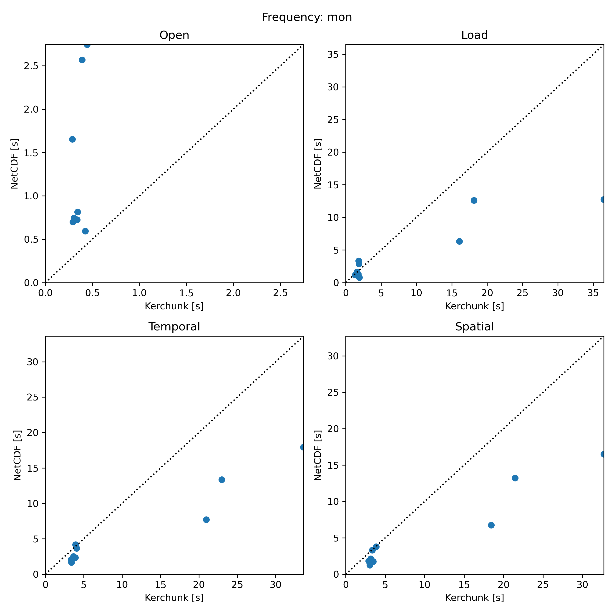

# Benchmark overview

This is a storage-faithful, head-to-head comparison between kerchunk references and native NetCDF using xCDAT workflows .

Environment

- Perlmutter CPU node; CMIP archive on near-compute NERSC storage.
- Dask threaded scheduler (`num_workers=8`), no distributed.
- `OMP/MKL/OPENBLAS_NUM_THREADS=1`.

Sampling and runs

- Frequencies: `mon`, `day` (separate analysis).
- `NFILES = 10` per frequency (stratified).
- `NTESTS = 3`; first run discarded; median of remaining runs reported.

Workload controls

- `FIXED_TIMESTEPS = 240` (leading slice).
- On-disk chunking preserved (`chunks={}`); no rechunking.
- Identical NetCDF file lists from kerchunk refs.
- `join="exact"` for NetCDF.

Phases timed

- Open
- Load
- Temporal (annual mean; build + compute)
- Spatial (area average; build + compute)

Purpose: backend comparison under realistic xCDAT workflows, not scaling.

Data are on NERSC near-compute storage.

## High-level differences from the original benchmark

This version is:

- More realistic: full xCDAT operations (bounds, group_average, spatial average), not just open/load.
- More controlled: fixed slice size, warmup discarded, median timing.
- More storage-faithful: no rechunking.
- Stricter: `join="exact"` to avoid silent alignment.
- Local threaded execution, not distributed.

It isolates backend behavior under typical HPC-local usage.

## Results

Points above diagonal: NetCDF slower.
Points below diagonal: Kerchunk slower.

### Monthly (`mon`)

- Open - Kerchunk consistently faster.
- Load -Small cases similar. Larger cases: NetCDF clearly faster.
- Temporal - Small cases close. Larger cases: NetCDF significantly faster.
- Spatial - Same pattern as temporal: NetCDF faster for heavier workloads.

Monthly summary: Kerchunk wins open. NetCDF wins compute for nontrivial sizes.

### Daily (`day`)

- Open - Kerchunk dramatically faster. NetCDF open cost scales with file count.
- Load - NetCDF generally faster.
- Temporal - NetCDF much faster.
- Spatial - NetCDF much faster.

Daily summary:
Kerchunk wins metadata open only. NetCDF dominates compute.

## Overall interpretation

On Perlmutter with CMIP data on near-compute storage:

- Kerchunk provides a consistent metadata/open advantage.
- NetCDF is consistently faster for actual data movement and reductions.
- The performance gap widens with dataset size and computational intensity.

## Possible causes (interpretation)

Source: ChatGPT 5.2

1. **Metadata aggregation**
   Kerchunk reads one JSON; NetCDF must aggregate many files. This explains open advantages, especially for daily data.

2. **Direct HDF5 access**
   NetCDF uses optimized POSIX/HDF5 reads on a high-performance filesystem. Kerchunk adds a reference indirection layer and fsspec overhead. On local HPC storage, this favors NetCDF.

3. **NetCDF chunking/layout quality and consistency**
   If NetCDF chunk shapes are a poor fit for the access pattern (or differ across files), load/reduction performance can change a lot. Report time-chunk stats and flag outliers; consider a subset with uniform chunking/encoding to isolate backend effects.

4. **Dask graph characteristics**
   Kerchunk may produce more granular/heavier graphs. In a local threaded scheduler, per-task overhead shows up during compute-heavy reductions.

5. **Environment effect**
   Kerchunk’s strongest benefits appear with remote object storage (high latency, many small files). Here, data are local and low-latency, reducing kerchunk’s advantage largely to metadata.

Bottom line: in this HPC-local scenario, kerchunk improves open time but does not improve, and often degrades, compute-heavy workflow performance relative to native NetCDF.

## Considerations / sensitivity checks

Source: ChatGPT 5.2

These follow-on checks quantify how sensitive the head-to-head results are to slicing, file-count, and execution settings, and help distinguish backend effects from artifact-of-setup effects.

- Align the time slice to chunk boundaries (or use whole time chunks); `time[:240]` may be misaligned and amplify partial-chunk reads.
- Sweep `FIXED_TIMESTEPS` (small/medium/large) to see whether overhead amortizes.
- Vary `NFILES` while holding total timesteps constant to isolate many-files metadata cost.
- Repeat with `num_workers` = 1/4/8/16 to check scheduler and I/O concurrency sensitivity.
- Optionally compare NetCDF engines (netcdf4 vs h5netcdf) and note cache state (cold vs warm).
