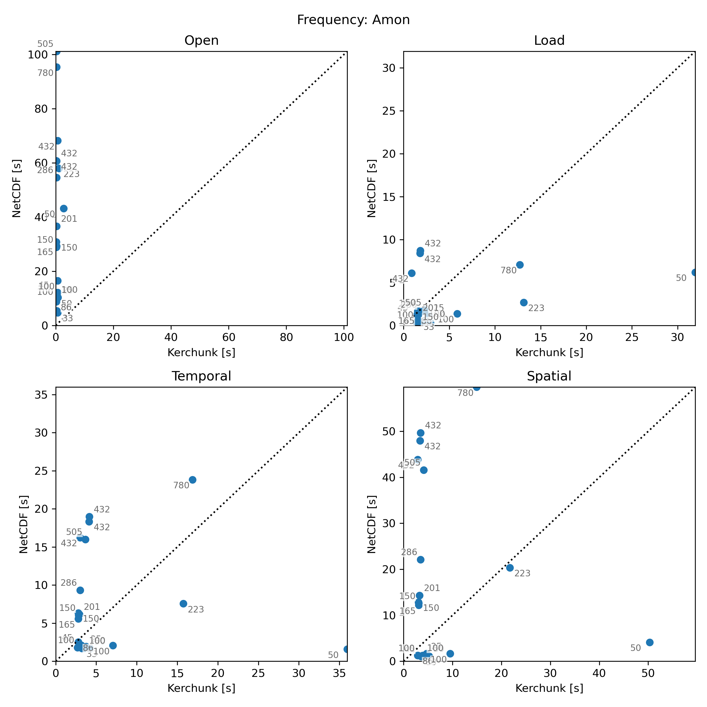
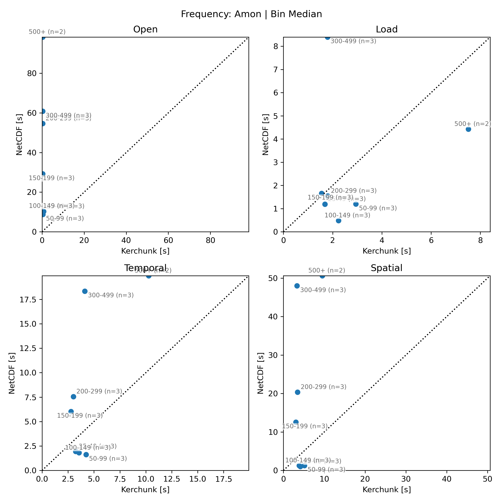

# Benchmark Summary (2026-04-16 file-count crossover)

## Summary

This run was directional follow-up benchmark for kerchunk vs native NetCDF in xCDAT, using bin-aware dataset selection instead of full sweep. Main question: how behavior changes as `netcdf_file_count` increases.

Bottom line from this run:

- Open: kerchunk wins everywhere, by large margin.
- Load: mixed; NetCDF still usually faster.
- Temporal/spatial reductions: crossover appears by bin in this run, with kerchunk favored from roughly `150-199` upward.
- `300-499` bin is strongest kerchunk win, but also most confounded because all successful rows there are HighResMIP `pr`.

## Plots

### Per-dataset timing



Shows spread and outliers across individual selected datasets.

### Per-bin median timing



Shows median behavior by file-count bin; best high-level crossover view.

## Run Coverage

- Artifacts:
  - `final_combined.csv`
  - `final_timing_vs_nfiles.png`
  - `final_timing_by_bin.png`
- Combined rows: `21`
- Successful rows: `20`
- Failed rows: `1`
- Successful bins:
  - `25-49`: 3
  - `50-99`: 3
  - `100-149`: 3
  - `150-199`: 3
  - `200-299`: 3
  - `300-499`: 3
  - `500+`: 2
- Failed case:
  - `CMIP6.CMIP.EC-Earth-Consortium.EC-Earth3.piControl.r2i1p1f1.Amon.tas.gr.v20210601`
  - mixed calendar types on `time`

## Main Findings

- Open:
  - kerchunk faster in `20/20`
  - median `open_ratio = 0.0144`
  - bin medians get smaller with file count, so metadata/open benefit grows with fragmentation
- Load:
  - kerchunk faster in `5/20`
  - median `load_ratio = 1.3202`
  - no clean monotonic crossover
  - `300-499` strongly favors kerchunk; most other bins favor NetCDF or sit near parity
- Temporal compute:
  - kerchunk faster in `10/20`
  - median `temporal_compute_ratio = 0.9933`
  - bin medians favor NetCDF through `100-149`
  - bin medians favor kerchunk from `150-199` onward
- Spatial compute:
  - kerchunk faster in `10/20`
  - median `spatial_compute_ratio = 1.3530`
  - same crossover shape as temporal, with stronger kerchunk wins in higher bins

High-signal examples:

- Best kerchunk reduction wins:
  - `CMCC-CM2-HR4 highres-future Amon pr` at 432 files
  - `temporal_compute_ratio = 0.1668`
  - `spatial_compute_ratio = 0.0876`
- Worst kerchunk reduction loss:
  - `TaiESM1 piControl day tas` at 50 files
  - `temporal_compute_ratio = 27.3992`
  - `spatial_compute_ratio = 12.7912`

## Plot Read

- `final_timing_vs_nfiles.png`: one point per dataset; use for spread and outliers.
- `final_timing_by_bin.png`: one point per bin; values are medians across successful rows in each bin; use for headline trend.
- In both plots:
  - x-axis = kerchunk time
  - y-axis = NetCDF time
  - above diagonal = NetCDF slower
  - below diagonal = kerchunk slower

## Caveats

- This is directional benchmark, not pure file-count control. Datasets still differ by model, variable, frequency, grid, and size.
- `300-499` bin is especially confounded because readable kerchunk coverage forced that bin to use HighResMIP `pr`.
- `500+` bin has only 2 successful rows, so read that bin more cautiously.
- Results are specific to this environment and workload:
  - Perlmutter CPU
  - near-compute CMIP storage
  - `time[:240]`
  - local threaded scheduler
  - no rechunking

## Practical Read

For teammate use, cleanest takeaway is:

- kerchunk very strong for metadata/open
- kerchunk looks promising for reduction-heavy workflows once file counts get into mid/high bins
- NetCDF still often better for plain load/materialization
- use dataset plot for truth, bin plot for summary

## xsearch File-Count Distribution

Archive is still heavily concentrated in low-file-count datasets:

| nfiles_bucket | path_count | path_pct | total_nfiles | total_nfiles_pct |
|---------------|-----------:|---------:|-------------:|-----------------:|
| 0-49 | 1098125 | 94.82 | 4545050 | 38.66 |
| 50-99 | 42659 | 3.68 | 3358691 | 28.57 |
| 100-199 | 14153 | 1.22 | 2160707 | 18.38 |
| 200-499 | 1457 | 0.13 | 417244 | 3.55 |
| 500-999 | 1442 | 0.12 | 866977 | 7.37 |
| 1000+ | 315 | 0.03 | 407667 | 3.47 |

That argues against blanket “kerchunk by default” for all near-compute analysis, even if high-file-count cases remain important pain points.

## Appendix: xsearch SQL

```sql
(
  SELECT '25-49' AS nfiles_bin, path, variable, nfiles
  FROM paths
  WHERE mip_era = 'CMIP6'
    AND cmipTable = 'Amon'
    AND experiment NOT LIKE '%highres%'
    AND nfiles BETWEEN 25 AND 49
    AND variable IN ('tas', 'ta', 'pr')
  ORDER BY FIELD(variable, 'tas', 'ta', 'pr'), nfiles, path
  LIMIT 3
)
UNION ALL
(
  SELECT '50-99' AS nfiles_bin, path, variable, nfiles
  FROM paths
  WHERE mip_era = 'CMIP6'
    AND cmipTable = 'Amon'
    AND experiment NOT LIKE '%highres%'
    AND nfiles BETWEEN 50 AND 99
    AND variable IN ('tas', 'ta', 'pr')
  ORDER BY FIELD(variable, 'tas', 'ta', 'pr'), nfiles, path
  LIMIT 3
)
UNION ALL
(
  SELECT '100-149' AS nfiles_bin, path, variable, nfiles
  FROM paths
  WHERE mip_era = 'CMIP6'
    AND cmipTable = 'Amon'
    AND experiment NOT LIKE '%highres%'
    AND nfiles BETWEEN 100 AND 149
    AND variable IN ('tas', 'ta', 'pr')
  ORDER BY FIELD(variable, 'tas', 'ta', 'pr'), nfiles, path
  LIMIT 3
)
UNION ALL
(
  SELECT '150-199' AS nfiles_bin, path, variable, nfiles
  FROM paths
  WHERE mip_era = 'CMIP6'
    AND cmipTable = 'Amon'
    AND experiment NOT LIKE '%highres%'
    AND nfiles BETWEEN 150 AND 199
    AND variable IN ('tas', 'ta', 'pr')
  ORDER BY FIELD(variable, 'tas', 'ta', 'pr'), nfiles, path
  LIMIT 3
)
UNION ALL
(
  SELECT '200-299' AS nfiles_bin, path, variable, nfiles
  FROM paths
  WHERE mip_era = 'CMIP6'
    AND cmipTable = 'Amon'
    AND experiment NOT LIKE '%highres%'
    AND nfiles BETWEEN 200 AND 299
    AND variable IN ('tas', 'ta', 'pr')
  ORDER BY FIELD(variable, 'tas', 'ta', 'pr'), nfiles, path
  LIMIT 3
)
UNION ALL
(
  SELECT '300-499' AS nfiles_bin, path, variable, nfiles
  FROM paths
  WHERE mip_era = 'CMIP6'
    AND cmipTable = 'Amon'
    AND experiment NOT LIKE '%highres%'
    AND nfiles BETWEEN 300 AND 499
    AND variable IN ('tas', 'ta', 'pr')
  ORDER BY FIELD(variable, 'tas', 'ta', 'pr'), nfiles, path
  LIMIT 3
)
UNION ALL
(
  SELECT '500+' AS nfiles_bin, path, variable, nfiles
  FROM paths
  WHERE mip_era = 'CMIP6'
    AND cmipTable = 'Amon'
    AND experiment NOT LIKE '%highres%'
    AND nfiles >= 500
    AND variable IN ('tas', 'ta', 'pr')
  ORDER BY FIELD(variable, 'tas', 'ta', 'pr'), nfiles, path
  LIMIT 3
);
```
