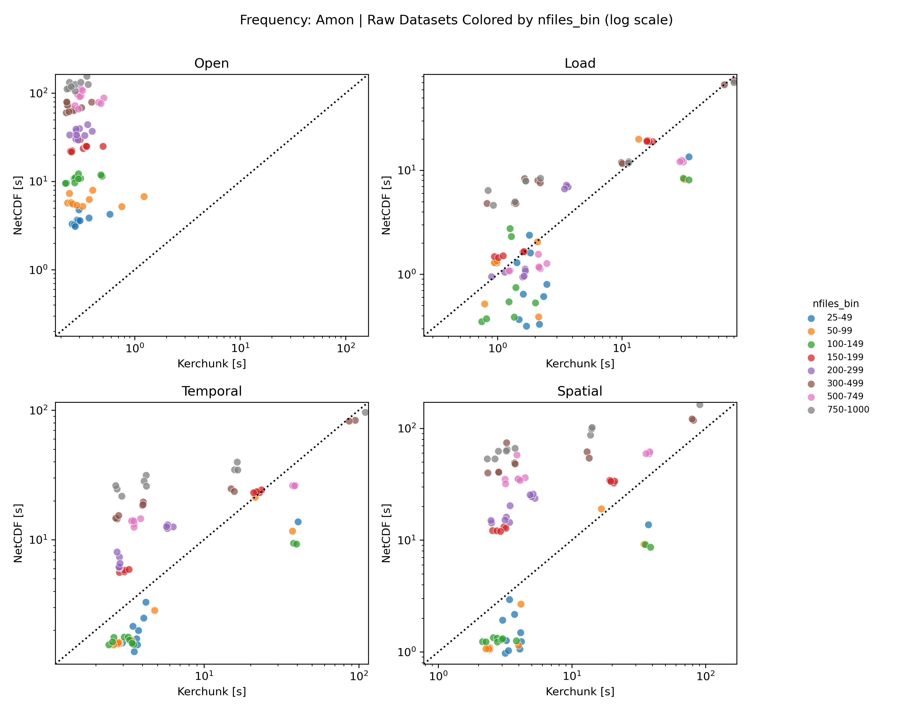
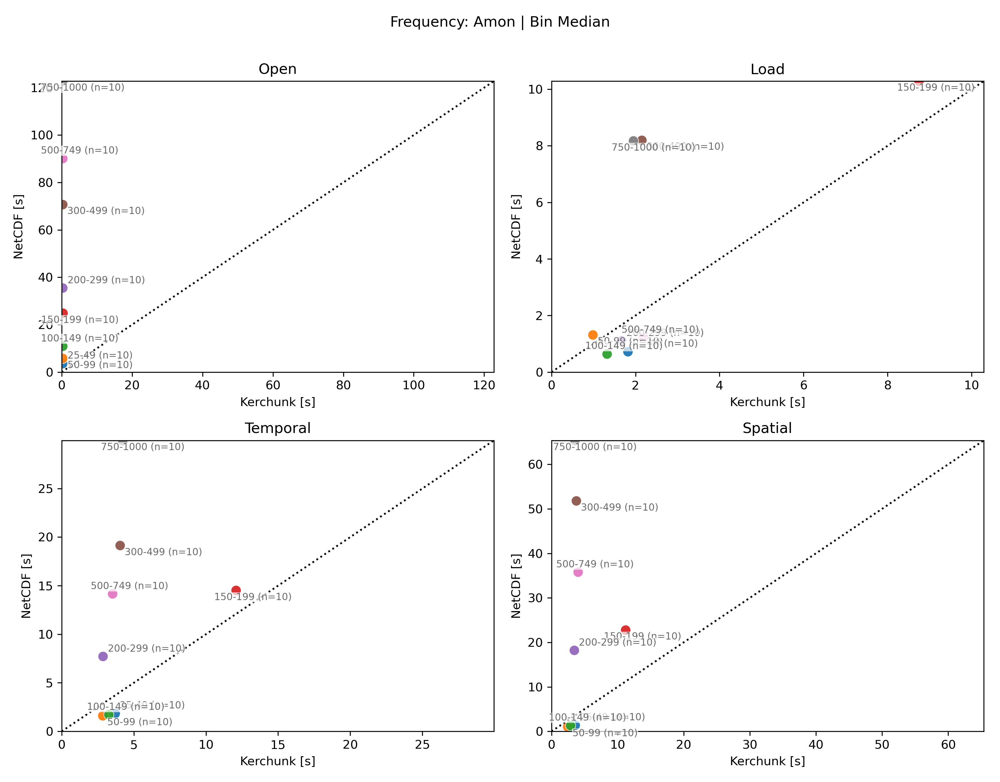

# Benchmark Summary (2026-04-22 file-count crossover upscale)

## Summary

This run is aligned with the previous file-count crossover benchmark. It suggests kerchunk becomes increasingly promising for mid- to high-file-count cases, with the clearest wins in this run appearing from about `150+` files onward.

Bottom line from this run:

- Open: kerchunk wins everywhere, by large margin.
- Load: mixed overall; NetCDF still looks better in several lower or mid bins, while kerchunk improves in parts of the higher-file-count range.
- Temporal/spatial reductions: NetCDF is favored in the lower-file-count bins (`25-49`, `50-99`, `100-149`), while kerchunk is clearly favored from roughly `150-199` upward.
- The strongest kerchunk wins in this run appear in `300-499`, but that bin is also more confounded because the successful rows there are all HighResMIP `pr`.

## Plots

### Per-dataset timing

Shows spread and outliers across individual selected datasets. The raw plot uses log scale because the timing range spans more than an order of magnitude.

### Per-bin median timing

Shows median behavior by file-count bin; best high-level crossover view.

## Run Coverage

- Artifacts:
  - `final_combined.csv`
  - `final_timing_vs_nfiles.png`
  - `final_timing_by_bin.png`
- Combined rows: `80`
- Successful rows: `80`
- Failed rows: `0`
- Successful bins:
  - `25-49`: 10
  - `50-99`: 10
  - `100-149`: 10
  - `150-199`: 10
  - `200-299`: 10
  - `300-499`: 10
  - `500-749`: 10
  - `750-1000`: 10

## Main Findings

- Open:
  - kerchunk faster in `80/80`
  - median `open_ratio = 0.0101`
  - bin medians keep shrinking with file count, so metadata/open benefit grows strongly with fragmentation
- Load:
  - kerchunk faster in `42/80`
  - median `load_ratio = 0.9801`
  - still mixed by bin, with no clean monotonic crossover
  - NetCDF is clearly favored in `25-49`, `100-149`, and `500-749`
  - kerchunk is clearly favored in `50-99`, `300-499`, and `750-1000`
- Temporal total:
  - kerchunk faster in `44/80`
  - median total ratio `= 0.9133`
  - lower-file-count bins (`25-49`, `50-99`, `100-149`) favor NetCDF
  - bin medians favor kerchunk from `150-199` onward
- Spatial total:
  - kerchunk faster in `51/80`
  - median total ratio `= 0.5566`
  - same crossover shape as temporal, with stronger kerchunk wins in higher bins
  - strongest bin-level win is `300-499`, followed by `750-1000`

## Plot Read

- `final_timing_vs_nfiles.png`: one point per dataset; use for spread and outliers.
- `final_timing_by_bin.png`: one point per bin; values are medians across successful rows in each bin; use for headline trend.
- In both plots:
  - x-axis = kerchunk time
  - y-axis = NetCDF time
  - above diagonal = NetCDF slower
  - below diagonal = kerchunk slower

## Caveats

- Amon frequency only.
- Binned by file count only. This is not a pure file-count control; datasets still differ by variable, data shape, grid, and chunking.
- `300-499` showed the strongest kerchunk wins, but those cases are all HighResMIP `pr`, so that result is encouraging but also more confounded than the other bins.
- The high-file-count tail was effectively capped around `nfiles ~= 780`, so even though the final summary uses `500-749` and `750-1000`, the upper end was not pushed beyond that because it was unnecessary for this pass.
- Results are specific to this environment and workload:
  - Perlmutter CPU
  - near-compute CMIP storage
  - `time[:240]`
  - local threaded scheduler
  - no rechunking
