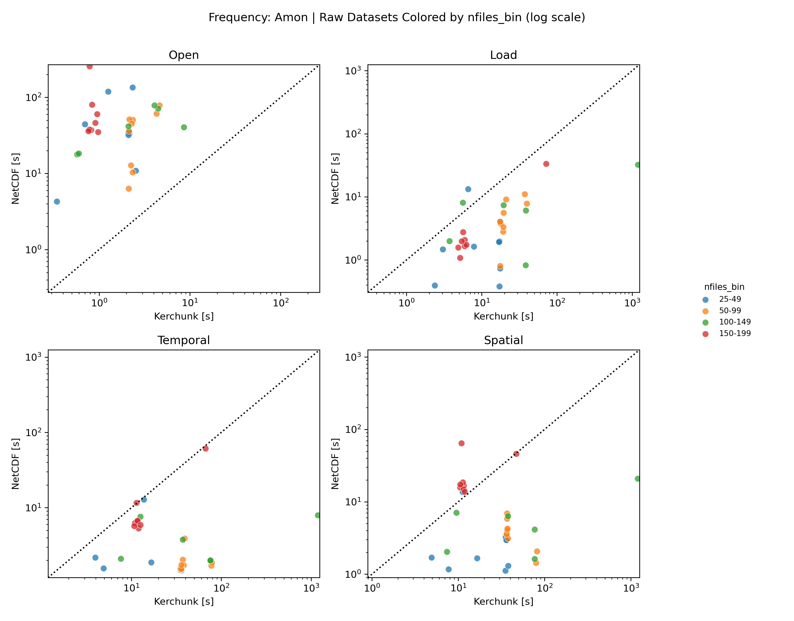
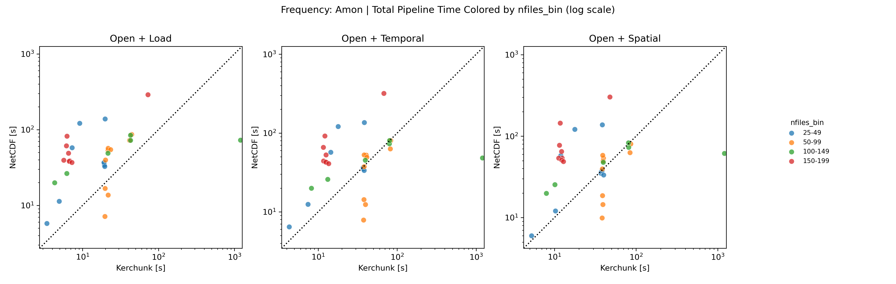
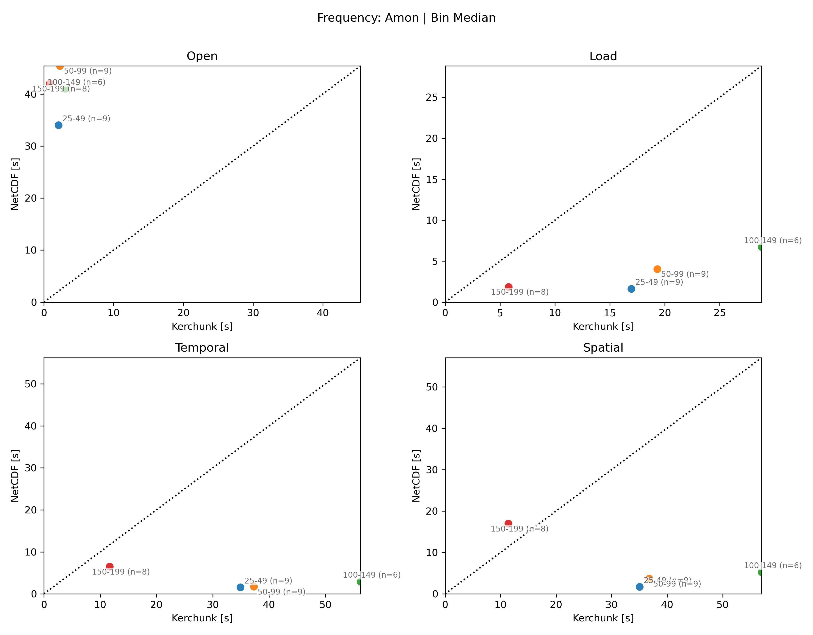

# Benchmark Summary (2026-05-22 daily file-count crossover upscale)

## Summary

This daily-only pass covers `25-199` files. Open is a clean kerchunk win. Load and pure temporal work still favor NetCDF. Pure spatial crosses over in `150-199`. Once open is included, kerchunk wins most end-to-end cases, with the strongest advantage in `150-199`.

Note: File counts above 200 were not included in this run due to the compute cost. Future work can explore higher file counts and the crossover behavior in more detail.

Bottom line:

- Open: kerchunk wins everywhere, by large margin.
- Load: NetCDF wins almost everywhere.
- Temporal: NetCDF wins almost everywhere on pure reduction time.
- Spatial: mixed overall; `150-199` flips to kerchunk.
- Total pipeline (`open+load`, `open+temporal`, `open+spatial`): kerchunk wins overall because the open advantage is large enough to offset much of the downstream loss.

## Plots

### Per-dataset timing

Raw component timings. Log scale.

- Open:
  - kerchunk faster in `32/32`
  - median `open_ratio = 0.0505`
  - advantage grows further in `150-199`
- Load:
  - kerchunk faster in `2/32`
  - median `load_ratio = 4.3121`
  - all bin medians favor NetCDF
- Temporal total:
  - kerchunk faster in `1/32`
  - median total ratio `= 14.0920`
  - all bin medians favor NetCDF, though `150-199` is much closer than the lower bins
- Spatial total:
  - kerchunk faster in `8/32`
  - median total ratio `= 7.6525`
  - `25-149` favors NetCDF
  - `150-199` favors kerchunk

### Total pipeline timing

Raw end-to-end timings for `open+load`, `open+temporal`, and `open+spatial`. Log scale.

- Total pipeline:
  - `open+load`: kerchunk faster in `28/32`, median ratio `= 0.4318`
  - `open+temporal`: kerchunk faster in `20/32`, median ratio `= 0.7468`
  - `open+spatial`: kerchunk faster in `21/32`, median ratio `= 0.8104`
  - `150-199` is the clearest kerchunk bin for all three total-time views

### Per-bin median timing

Median view by file-count bin.

- The bin-median view keeps the same shape as the raw plots.
- Open favors kerchunk in every populated bin.
- Load favors NetCDF in every populated bin.
- Temporal favors NetCDF in every populated bin, but `150-199` is much closer.
- Spatial flips in `150-199`, which is the clearest pure-operation crossover in this run.

## Run Coverage

- Artifacts:
  - `final_combined.csv`
  - `final_timing_vs_nfiles.png`
  - `final_total_timing_vs_nfiles.png`
  - `final_timing_by_bin.png`
- Combined rows: `34`
- Successful rows: `32`
- Failed rows: `1`
- Skipped rows: `1`
- Successful bins:
  - `25-49`: 9
  - `50-99`: 9
  - `100-149`: 6
  - `150-199`: 8

## Plot Read

- `final_timing_vs_nfiles.png`: raw component timings.
- `final_total_timing_vs_nfiles.png`: raw end-to-end timings.
- `final_timing_by_bin.png`: bin medians across successful rows.
- In all plots:
  - x-axis = kerchunk time
  - y-axis = NetCDF time
  - above diagonal = NetCDF slower
  - below diagonal = kerchunk slower

## Caveats

- Day frequency only.
- Only four bins were populated: `25-49` through `150-199`. This was due to the compute
  cost of loading and processing larger file counts with NetCDF.
- One failure was NorESM2-LM `day/tas` from a `lon_bnds` merge conflict.
- One ICON case was skipped because the benchmark returned `None`.
- Results are specific to this environment and workload.
