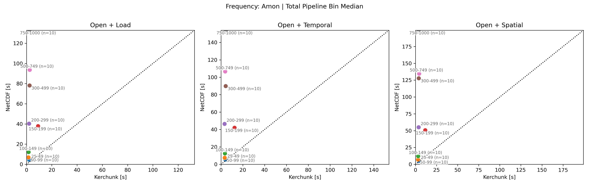

# Kerchunk vs NetCDF: Overall Summary for xCDAT on NERSC CMIP Data

This is a high-level synthesis of benchmark, metadata-validation, and API-output-comparison results for `kerchunk` versus source `netcdf` inputs in xCDAT workflows on NERSC near-compute CMIP data.

## Overall Takeaway

- `kerchunk` is the clear winner for metadata and dataset open cost.
- In the benchmarked near-compute workflows, `netcdf` is usually the better default for typical source-layout xCDAT analysis across the common `0-49`, `50-99`, and `100-149` file-count ranges.
- `kerchunk` becomes compelling again in crossover cases, especially from `150-199` onward in the newer crossover-upscale benchmark.
- End-to-end workflow timing is an important separate lens: even when individual `load` or reduction phases favor `netcdf`, full pipelines can still favor `kerchunk` once `open` is included.
- Metadata and API validation do not show a broad kerchunk-vs-netcdf regression.
- The remaining correctness issues are concentrated in a small ECMWF HighResMIP time-axis family plus one shared vertical chunking error.

## Recommended Default Policy

Use `netcdf` as the default backend for ordinary near-compute xCDAT analysis in the common lower file-count bins, and start testing `kerchunk` first when metadata/open cost dominates or when end-to-end workflows reach the higher file-count ranges beginning at `150-199`. Treat the ECMWF HighResMIP family as a known exception that should be validated more carefully regardless of backend choice.

## Use-Case Guidance

| use case                                                                          | recommended backend   | why                                                                                                                    |
| --------------------------------------------------------------------------------- | --------------------- | ---------------------------------------------------------------------------------------------------------------------- |
| Metadata-heavy or many-file open                                                  | `kerchunk`            | Open consistently favors `kerchunk`, often by a large margin.                                                          |
| Compute-focused local xCDAT load and reductions in `0-49`, `50-99`, and `100-149` | `netcdf`              | In the benchmarked workflows, `load` plus temporal/spatial reductions usually favor `netcdf` in these lower bins. |
| End-to-end workflows beginning at `150-199`                                       | test `kerchunk` first | Once `open` is included, full pipelines become increasingly favorable to `kerchunk` in the higher-count bins.          |

## Performance Summary

Across the current benchmark reports, the stable pattern is that `kerchunk` wins `open`, `netcdf` usually wins `load` in the lower bins, and compute-heavy reductions depend strongly on file-count bin and workload shape. In the benchmarked NERSC near-compute archive workflows, that makes `netcdf` the usual default for those lower bins, while `kerchunk` remains a targeted optimization for metadata-heavy cases and for the higher-count bins where crossover appears.

One key distinction is that individual operation timings and end-to-end workflow timings do not lead to the same conclusion. Looking at `load`, `temporal`, or `spatial` in isolation often favors `netcdf`, but the daily crossover benchmark shows that once `open` is included, `kerchunk` wins most full pipelines because the metadata/open advantage is large enough to offset much of the downstream loss.

The strongest decision points are:

- `open` consistently favors `kerchunk`, while `load` usually favors `netcdf`
- temporal and spatial reductions usually favor `netcdf` in the `0-49`, `50-99`, and `100-149` ranges
- end-to-end totals can favor `kerchunk` even when individual downstream phases favor `netcdf`
- in the daily `25-199` benchmark, `kerchunk` won most total pipelines: `open+load` in `28/32`, `open+temporal` in `20/32`, and `open+spatial` in `21/32`
- in the newer crossover-upscale benchmark, temporal and spatial bin medians favor `kerchunk` from `150-199` onward, and total-pipeline bin medians favor `kerchunk` in every populated bin
- the strongest observed wins in that run appear in `300-499`, with additional strong behavior in `750-1000`, though the source report notes those upper bins are more confounded or capped

Two especially useful benchmark views are the file-count crossover studies:

- [20260422-steve-file-count-crossover-upscale/summary.md](20260422-steve-file-count-crossover-upscale/summary.md) is the best current broad crossover summary: it covers `25-49` through `750-1000`, shows clean `open` wins for `kerchunk`, and shows temporal/spatial crossover from `150-199` onward.
- [20260522-steve-file-count-crossover-upscale-daily/summary.md](20260522-steve-file-count-crossover-upscale-daily/summary.md) makes the end-to-end workflow point explicit: once `open` is included, `kerchunk` wins most total pipelines across `25-199`, with the clearest advantage in `150-199`.

### Representative Plots

Per-bin median timing across `25-49` through `750-1000`. Main conclusion: `kerchunk` wins `open` throughout, while temporal and spatial reductions usually favor `netcdf` in the lower bins and then flip toward `kerchunk` from `150-199` onward. Source: [20260422-steve-file-count-crossover-upscale/summary.md](20260422-steve-file-count-crossover-upscale/summary.md)

Median end-to-end timing by file-count bin. Main conclusion: once `open` is included, `kerchunk` is favored in every populated bin of this benchmark, even though some individual downstream phases still favor `netcdf`. Source: [20260422-steve-file-count-crossover-upscale/summary.md](20260422-steve-file-count-crossover-upscale/summary.md)

## Validation Summary

### Metadata/CF Validation

The metadata and CF-oriented validation results are mostly clean and do not point to a broad backend integrity problem.

- `21/30` datasets passed all checks
- the `100-149` bin passed cleanly
- the main repeated failure family is ECMWF HighResMIP `pr`, where kerchunk time decoding exposes `618` time steps while NetCDF exposes `780`
- there is no evidence of broad xCDAT CF-axis detection problems

This suggests the observed failures are concentrated in specific kerchunk JSON references or source-publication mismatches, not in a general kerchunk-vs-netcdf metadata regression. Source: [20260605-metadata-cf-validation/20260605_144947_summary.md](20260605-metadata-cf-validation/20260605_144947_summary.md)

### API Output Comparison

The API output comparison also comes back mostly clean, with failures concentrated in a very small set of datasets and operations.

- `44/60` rows passed all checks
- `6` validation failures are concentrated in `2` ECMWF datasets
- `4` execution errors are all `vertical`
- those `vertical` errors all share the same dask `temp_unique` chunking problem

The main correctness signal here is again localized rather than broad: most rows compare cleanly, while the remaining issues cluster around ECMWF time-axis mismatch/truncation behavior and one shared vertical execution failure mode. Source: [20260702-api-output-comparison/run_3bins_5datasets_summary.md](20260702-api-output-comparison/run_3bins_5datasets_summary.md)

## Known Issue Families

- Primary correctness issue: ECMWF HighResMIP kerchunk time-axis mismatch or truncation
- Secondary execution issue: shared `vertical` `temp_unique` chunking failure in API comparison runs
- Secondary metadata issue: one filename/path-resolution issue already identified in prior metadata validation work
- Low-priority drift issue: one provenance/publication drift case that is not CF-significant

The most detailed follow-up for the ECMWF time issue is here: [../../ecmwf_time_report.md](../../ecmwf_time_report.md)

## Detailed Sources

- [20260422-steve-file-count-crossover-upscale/summary.md](20260422-steve-file-count-crossover-upscale/summary.md)
- [20260522-steve-file-count-crossover-upscale-daily/summary.md](20260522-steve-file-count-crossover-upscale-daily/summary.md)
- [20260605-metadata-cf-validation/20260605_144947_summary.md](20260605-metadata-cf-validation/20260605_144947_summary.md)
- [20260702-api-output-comparison/run_3bins_5datasets_summary.md](20260702-api-output-comparison/run_3bins_5datasets_summary.md)
- [../../ecmwf_time_report.md](../../ecmwf_time_report.md)
