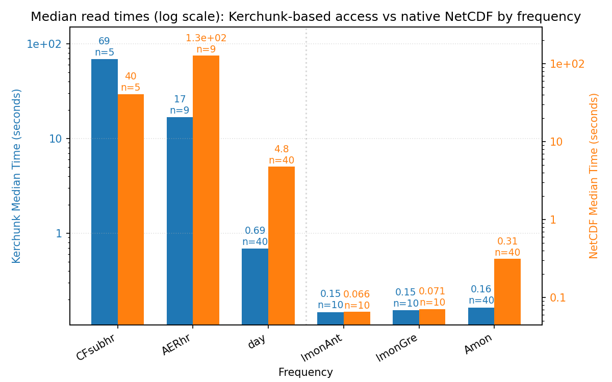
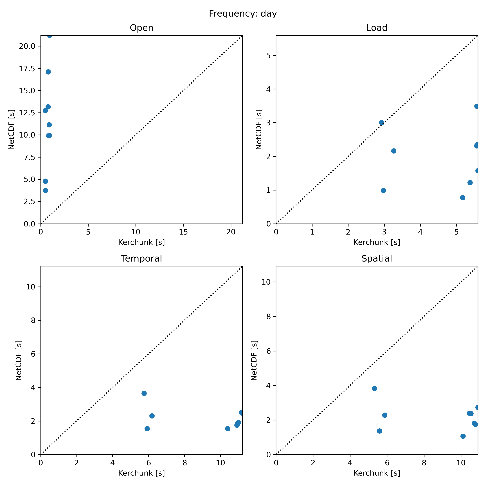
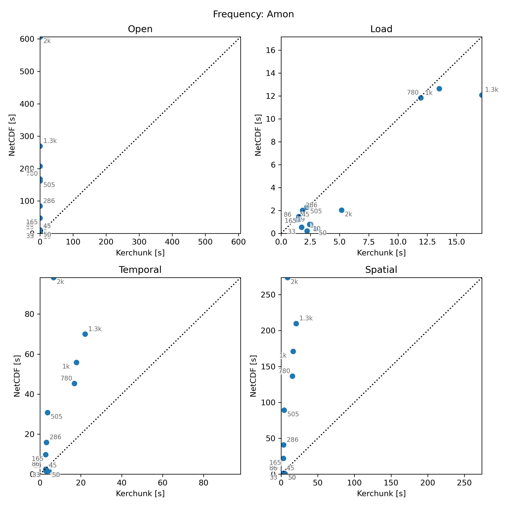

# Kerchunk vs NetCDF on NERSC Near-Compute CMIP Data

## **Overall takeaway**

On Perlmutter/NERSC with CMIP archive data next to compute and no rechunking, `kerchunk` is a clear win for metadata and open time, but it is not a universal compute win. For realistic xCDAT workflows on source-layout data, `NetCDF` often performs better for `load` and moderate-file-count reductions, while `kerchunk` becomes strongly favorable again at very high file counts.

Because most CMIP datasets in the xsearch inventory fall in the `0-49` file range, `NetCDF` should likely remain the default overall in this environment, with `kerchunk` used as a targeted optimization for metadata-heavy or highly fragmented datasets.

## Context

All benchmarks below use **CMIP archive data on NERSC near-compute storage** rather than rechunked analysis-ready layouts.

- **Benchmark 1:** `20260108_172139` aggregated frequency-level read/load results.
- **Benchmark 2:** `20260126_130127` end-to-end read/load analysis across multiple frequencies.
- **Benchmark 3:** `20260227-steve` workflow-faithful xCDAT runs with **preserved on-disk chunking**, a fixed `time[:240]` slice, and separate timing for `open`, `load`, temporal, and spatial phases.
- **Benchmark 4:** `20260313-steve-file-count` Amon file-count sweep from `1` to `2000` files.

## Benchmark 1 - **Early read/load studies**

- **Scope:** Earlier aggregate runs (`20260108_172139`, `20260126_130127`) were dominated by open plus end-to-end read/load behavior.
- **Result:** In those studies, `kerchunk` usually beat `NetCDF`, often by large margins as file counts increased.
- **Why it matters:** This is consistent with `kerchunk` avoiding expensive multi-file metadata aggregation.

<p>
  
</p>

This plot captures the early aggregate read/load behavior, where `kerchunk` often won strongly.

## Benchmark 2 - **Workflow-faithful xCDAT runs**

- **Open:** In the later workflow benchmark (`20260227-steve`), `kerchunk` consistently won `open`.
- **Load:** `NetCDF` usually won `load`.
- **Reductions:** `NetCDF` also generally won temporal and spatial reductions for the sampled monthly and daily cases.

<p>
  
</p>

<p>
  
</p>

These are the most representative plots for realistic local xCDAT workflows on near-compute source-layout data.

## Benchmark 3 - **Very high file counts**

- **Crossover:** The file-count sweep (`20260313-steve-file-count`) shows that the compute story is not simply "NetCDF always wins."
- **Observed pattern:** `open` favored `kerchunk` in 14/14 successful datasets, while `load` favored `NetCDF` in most cases.
- **High-end behavior:** At the highest file counts, compute flipped back toward `kerchunk`.

At 2000 files, temporal total was `6.664s` vs `98.177s`, and spatial total was `8.666s` vs `273.685s` in favor of `kerchunk`.

<p>
  
</p>

This plot shows the crossover clearly: `open` always favors `kerchunk`, `load` mostly favors `NetCDF`, and compute can flip back toward `kerchunk` at very high file counts.

## **Recommended interpretation**

- Use `kerchunk` when metadata/open cost matters, or when datasets are highly fragmented.
- Keep `NetCDF` as the likely default for near-compute source-layout analysis on NERSC.
- Do not assume `kerchunk` will speed up compute-heavy xCDAT workflows on local HPC storage.
- Let both file count and actual usage pattern drive backend choice.

## xsearch file-count distribution

| nfiles_bucket | path_count | path_pct | total_nfiles | total_nfiles_pct |
|---------------|-----------:|---------:|-------------:|-----------------:|
| 0-49 | 1098125 | 94.82 | 4545050 | 38.66 |
| 50-99 | 42659 | 3.68 | 3358691 | 28.57 |
| 100-199 | 14153 | 1.22 | 2160707 | 18.38 |
| 200-499 | 1457 | 0.13 | 417244 | 3.55 |
| 500-999 | 1442 | 0.12 | 866977 | 7.37 |
| 1000+ | 315 | 0.03 | 407667 | 3.47 |

- `NetCDF` is the likely default overall because most paths fall in the `0-49` range.
- `path_count` is not the same as workload impact: higher buckets still account for a large share of total files, so `kerchunk` remains useful for targeted cases.

<details>
<summary>MySQL query used to generate xsearch file-count buckets</summary>

```sql
SELECT
  bucket.nfiles_bucket,
  bucket.path_count,
  ROUND(100.0 * bucket.path_count / totals.total_path_count, 2) AS path_pct,
  bucket.total_nfiles,
  ROUND(100.0 * bucket.total_nfiles / totals.total_nfiles, 2) AS total_nfiles_pct
FROM (
  SELECT
    CASE
      WHEN nfiles >= 0   AND nfiles < 50   THEN '0-49'
      WHEN nfiles >= 50  AND nfiles < 100  THEN '50-99'
      WHEN nfiles >= 100 AND nfiles < 200  THEN '100-199'
      WHEN nfiles >= 200 AND nfiles < 500  THEN '200-499'
      WHEN nfiles >= 500 AND nfiles < 1000 THEN '500-999'
      ELSE '1000+'
    END AS nfiles_bucket,
    COUNT(*) AS path_count,
    SUM(nfiles) AS total_nfiles,
    MIN(nfiles) AS min_nfiles
  FROM paths
  GROUP BY
    CASE
      WHEN nfiles >= 0   AND nfiles < 50   THEN '0-49'
      WHEN nfiles >= 50  AND nfiles < 100  THEN '50-99'
      WHEN nfiles >= 100 AND nfiles < 200  THEN '100-199'
      WHEN nfiles >= 200 AND nfiles < 500  THEN '200-499'
      WHEN nfiles >= 500 AND nfiles < 1000 THEN '500-999'
      ELSE '1000+'
    END
) AS bucket
CROSS JOIN (
  SELECT
    COUNT(*) AS total_path_count,
    SUM(nfiles) AS total_nfiles
  FROM paths
) AS totals
ORDER BY bucket.min_nfiles;
```

</details>

## **Caveats**

- This is not a pure nfiles-only control experiment; datasets also differ by variable, model, grid, and physical size.
- The later workflow benchmarks use a fixed `time[:240]` slice, which may interact with source chunk boundaries.
- Results are specific to this environment: Perlmutter CPU, Dask threaded local execution, CMIP archive data on NERSC near-compute storage, no rechunking.
- One dataset in the file-count sweep failed due mixed calendar types, so that run is based on 14 successful datasets.
